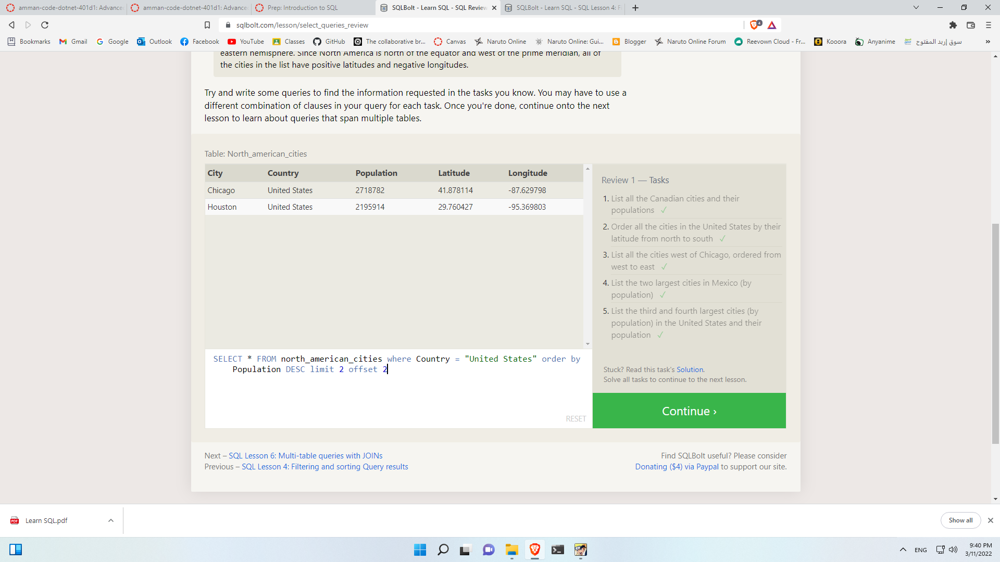

# SQL Bolt
### SQL Lesson 1: SELECT queries 101

### SQL Lesson 2: Queries with constraints

### SQL Lesson 3: Queries with constraints

### SQL Lesson 4: Filtering and sorting Query results

### SQL Lesson 5: Simple SELECT Queries

### SQL Lesson 6: Multi-table queries with JOINs

### SQL Lesson 7: OUTER JOINs

### SQL Lesson 8: A short note on NULLs

### SQL Lesson 9: Queries with expressions

### SQL Lesson 10: Queries with aggregates

### SQL Lesson 11: Queries with aggregates

### SQL Lesson 12: Order of execution of a Query

### SQL Lesson 13: Inserting rows

### SQL Lesson 14: Updating rows

### SQL Lesson 15: Deleting rows

### SQL Lesson 16: Creating tables

### SQL Lesson 17: Altering tables

### SQL Lesson 18: Dropping tables

### ALL DONE

